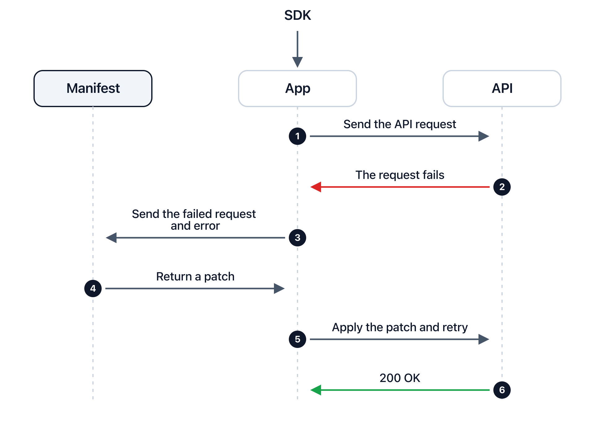

<div align="center">


# Manifest for Hermes

**Turn 🔴 rejected tool calls into 🟢 successful ones in real time.**

[](https://github.com/mnfst/manifest-hermes/actions/workflows/ci.yml)
[](https://github.com/mnfst/manifest-hermes)
[](plugin.yaml)
[](https://www.python.org/downloads/)

</div>

---

## What is Manifest

Manifest is a self-healing layer that fixes and retries failed API requests on the fly.

* 🎯 **Fix failures automatically** before they impact your users.
* 🔔 **Get notified of root causes** so you can fix them permanently.
* 🔌 **Works across your stack** with internal APIs, external services, and agent tools.

This plugin brings that layer to [Hermes](https://github.com/NousResearch/hermes-agent): an MCP tool call is rejected, Manifest repairs the arguments, the retry succeeds. The model never sees the failure.

## How it works



## Prerequisites

- <a href="https://github.com/NousResearch/hermes-agent" target="_blank">Hermes</a> with plugins enabled
- <a href="https://www.python.org/downloads/" target="_blank">Python 3.10</a> or higher

## Get started

```sh
hermes plugins install mnfst/manifest-hermes
hermes plugins enable manifest
```

No other dependency.

## Setup

1. Create a project in your [Manifest dashboard](https://dashboard.manifest.build) and copy its project key.
2. Set the key as an environment variable, when prompted or in the Hermes env file:

```sh
export MNFST_KEY='your-project-key'
```

3. Restart Hermes so the plugin loads.

That is the whole setup. `MNFST_URL` points the plugin at another Manifest endpoint if you need one. There is no other configuration. Self-healing is enabled by default in your project settings.

## Try it

Let your agent make a tool call that would normally be rejected. Manifest catches it, repairs the arguments, and retries:

```
You: fetch my 5 most recent emails

  GMAIL_FETCH_EMAILS { max_results: "5" }   ← rejected, max_results must be an integer
  GMAIL_FETCH_EMAILS { max_results: 5 }     ← Manifest's patch, retried automatically

Agent: Here are your 5 most recent emails…
```

The agent only ever sees the healed result. Check your [Manifest dashboard](https://dashboard.manifest.build) to see all repairs and insights.

## What is covered

| The agent calls… | Covered |
| --- | --- |
| An MCP tool, from any MCP server | ✅ healed |
| A built-in tool, including API-backed ones such as `web_search` | ❌ never repaired |
| A local tool (terminal, file, memory) | ❌ never sent anywhere |

Hermes registers MCP tools under an `mcp-<server>` toolset. A tool the registry cannot place counts as local, so an unreadable registry heals nothing rather than everything.

Hermes places a capture under the MCP server that rejected the call, with each tool as its own endpoint.

## How the repair works

`transform_tool_result` sends a failed tool result to the Manifest heal API. When corrected arguments come back, the plugin **re-invokes the tool itself** and returns the healed result. The model never sees Manifest, a retry instruction, or the repair. One heal and one internal retry per failure; anything unexpected passes the original result through.

The retry goes through Hermes' own call path, so every hook and guard that ran on the first call runs again. [How the retry, the 418 sentinel and the measurement log work](docs/guide.md).

## Updating

```sh
hermes plugins update manifest
```

That pulls the latest commit into `~/.hermes/plugins/manifest`. Restart Hermes afterwards so the new code loads. If the install is pinned to a commit or is not a git checkout (a copied directory), Hermes refuses to pull; reinstall instead:

```sh
hermes plugins install mnfst/manifest-hermes --force
```

## Privacy

Tool names, arguments, and error text of rejected external calls are sent to Manifest. Credential-named fields are withheld; nested business data is not.

## More

[Configuration, limits & development](docs/guide.md) · [Node.js SDK](https://github.com/mnfst/manifest-node) · [Python SDK](https://github.com/mnfst/manifest-python) · [PHP SDK](https://github.com/mnfst/manifest-php) · [Website](https://manifest.build)
